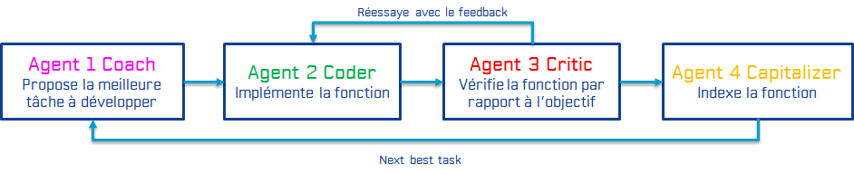

# Collab HumanLLM functions creation XP 2024

## Prerequisites 

- Python 3.10+
- Venv or Conda env
- VSCode

## Installation

```
python -m venv venv
source venv/bin/activate
pip install -r requirements.txt
```

MODIFY CONFIG.PY with the IP that will be given to be able to access the local ElasticSearch data server

## Launching the learning to develop new functions

To start the collaborative development process for new commands, execute the command:

```
python learn.py
```

## The basic architecture

*1. Database (documentary and vectorial)* ElasticSearch: capitalizes our trials, stores new functions (can perform similarity search), is used with Kibana to temporarily store conversational agent results and visualize them

*2. Capacity/Functions Development Agent System* Learn.py: iterative process of proposing new tasks to automate, coding, validation (go or new coding attempt), capitalization (indexing for reuse).


*PRINCIPLES*
1. Proposal for new task => adapt the proposed task (short term) or adapt the agent's role (long term)
2. Code proposal => adapt the code (short term) or adapt the agent's role (long term)
3. Critique proposal => modify the critique (short term) or correct the agent's role (long term)
4. Proposal for task indexing description => correct the description (short term) or correct the agent's role (long term)

*Human LLM Mechanism*: (TO EDIT CODE OR TEXT: a file is automatically opened in VSCode, it is by closing it that the text is validated and the process continues) \
1. control what will be sent to the agent Before () \
> A. Modify agent's system prompt (role & global context, constraints, examples). \
> B. Add instruction or information to agent. \
> C. Skip and set LLM output from recent outputs or manually define it. \
> D. Log comments. \
> E. See all previous results for this agent. \
> F. See previous MODIFIED/SCORED/COMMENTED results for this agent. \
> G. Skip human actions for N rounds. \
> H. Exit program. \
> P. Proceed to inference using a PREMIUM LLM. \

2. control the agent's "After" output to modify it or learn to improve what is sent to it () \
> A. Manually set the answer/OUTPUT (I don't want to try to improve agent's system prompt). \
> B. Criticize this answer to get an improved answer. \
> C. Find a better Prompt by providing critic and/or ideal answer. \
> D. ANNOTATE: evaluate & comment answer (Score between 0(worst)-1(top), and explain) to improve future results by using scored/commented examples. \
> E. Go back BEFORE inference to improve system prompt or add information to user message. \
> G. Skip human actions for N rounds. \
> H. Exit program. \

The validated functions that we will capitalize are placed in the **functions directory**. \
Prompts contain the "system prompts" sent to agents but it is much preferable to modify them from learn.py (via the Human LLM mechanism). \